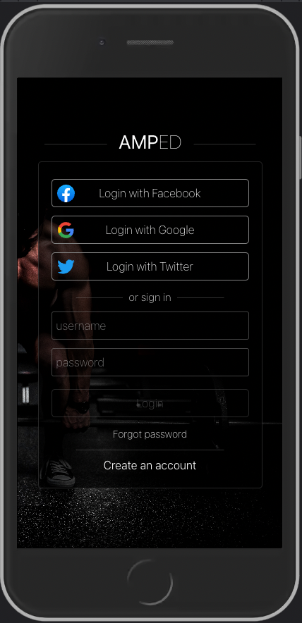
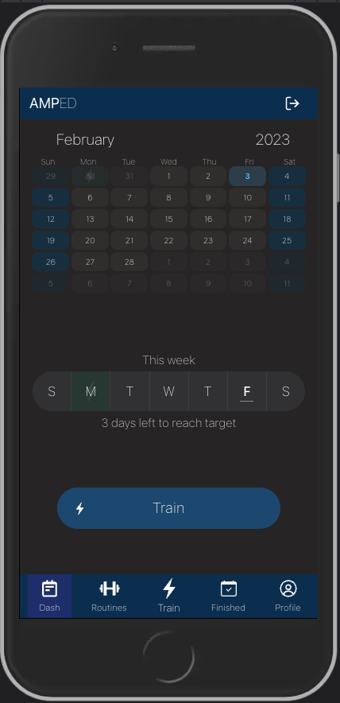
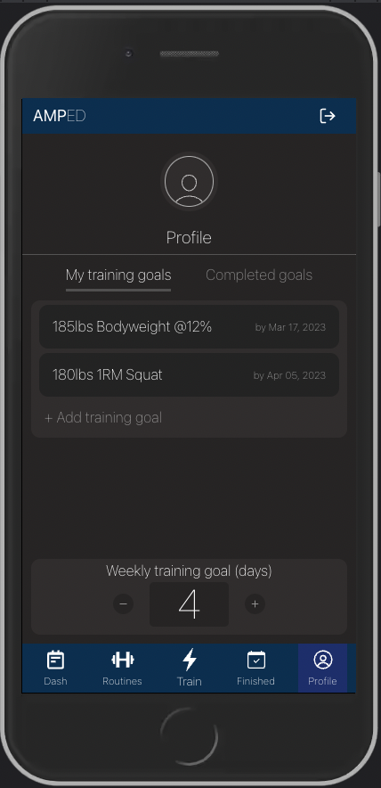
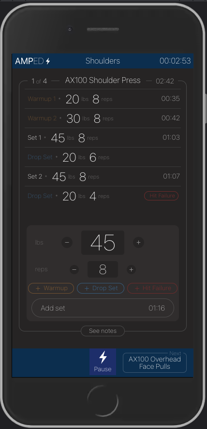
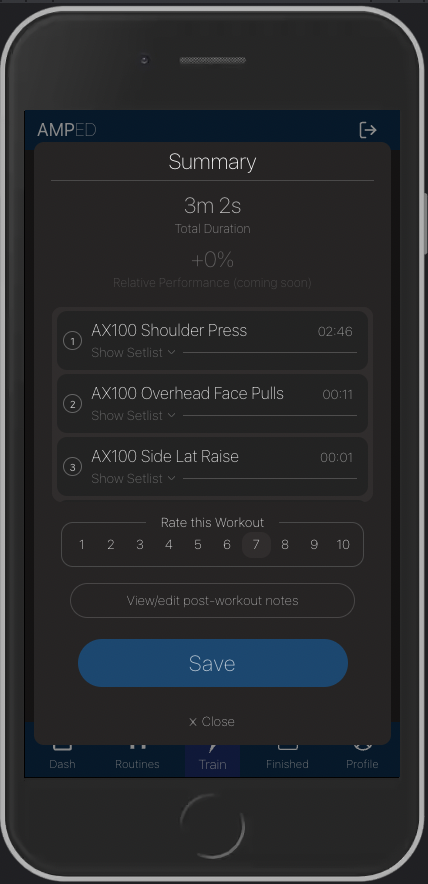
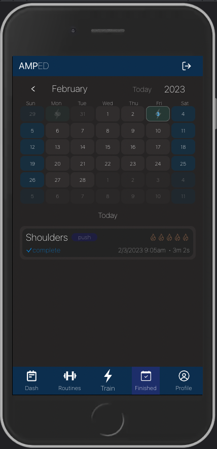

<!-- Button Shields (only available when repo goes public)  -->

<!-- PROJECT LOGO -->
 

  <h3 align="center">AMPED</h3>

  

    A workout tracker web app designed for mobile. 
     
     
    <a href="https://ampedpro.netlify.app">Live Site</a>
    ·
    <a href="https://github.com/ryanhartwig/amped/issues">Report Bug</a>
    ·
    <a href="https://github.com/ryanhartwig/amped/issues">Request Feature</a>
  

<!-- TABLE OF CONTENTS -->

  
Table of Contents

  <ol>
    <li>
      <a href="#about-the-project">About The Project</a>
      <ul>
        <li><a href="#technologies">Technologies</a></li>
      </ul>
    </li>
    <li><a href="#roadmap">Roadmap</a></li>
    <li><a href="#contributing">Contributing</a></li>
    <li><a href="#license">License</a></li>
    <li><a href="#acknowledgments">Acknowledgments</a></li>
  </ol>

<!-- ABOUT THE PROJECT -->
## About The Project

  
  
  
  
  
  

  

AMPED is a workout tracker application that lets you create routines, exercises, and enter active sessions which allow you to keep track of set & rep data, evaluate workout performance and attach notes to each session.

User's can:

* Schedule created routines by day of week
* Add training goals with deadlines
* Easily see performed workouts with an interactive calendar
* Set a weekly training target (days / week) which updates when completing a routine each day
* Enter custom sessions, allowing them to choose exercises to perform as they go

(<a href="#top">back to top</a>)

### Technologies

Libraries, frameworks & APIs used to create this app: 

* [React.js](https://reactjs.org/)
* [Redux](https://https://redux.js.org/)
* [Typescript](https://www.typescriptlang.org/)
* [Express.js](https://expressjs.com/)
* [Passport.js](https://www.passportjs.org/)
* [PostgreSQL.js](https://www.postgresql.org/)

(<a href="#top">back to top</a>)

<!-- ROADMAP -->
## Roadmap

See the [open issues](https://github.com/ryanhartwig/amped/issues) for a full list of proposed features (and known issues).

(<a href="#top">back to top</a>)

<!-- CONTRIBUTING -->
## Contributing

If you have a suggestion that would make this better, please fork the repo and create a pull request. You can also simply open an issue with the tag "enhancement".
Don't forget to give the project a star! Thanks again!

1. Fork the Project
2. Create your Feature Branch (`git checkout -b feature/AmazingFeature`)
3. Commit your Changes (`git commit -m 'Add some AmazingFeature'`)
4. Push to the Branch (`git push origin feature/AmazingFeature`)
5. Open a Pull Request

(<a href="#top">back to top</a>)

<!-- LICENSE -->
## License

Distributed under the MIT License. See `LICENSE.txt` for more information.

(<a href="#top">back to top</a>)

<!-- ACKNOWLEDGMENTS -->
## Acknowledgments

Here's a list of helpful resources used to bring this project to life:

* [React Icons](https://react-icons.github.io/react-icons/search)

(<a href="#top">back to top</a>)

